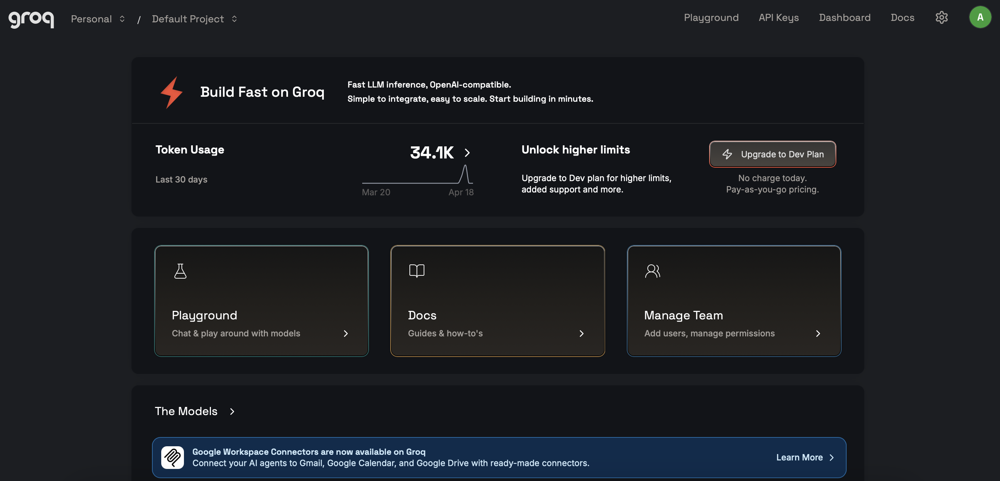
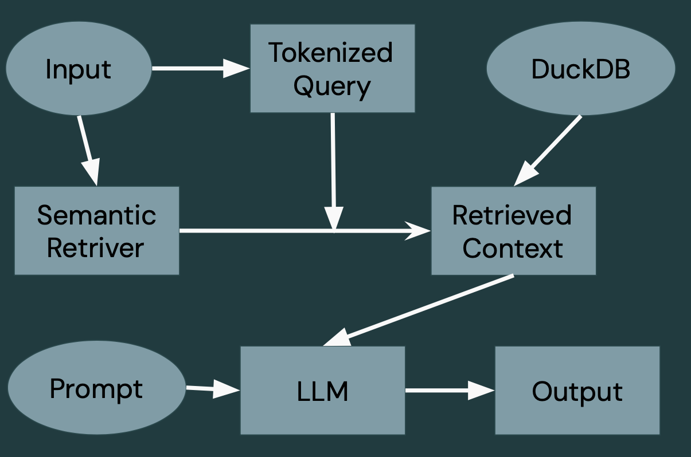

# Milestone 2 Report

## LLM Choice

The LLM model used to support the RAG chain is the `qwen3-32b` model which was accessed using Groq. This model is quite large in comparison to the initally suggested models, so locally downloading and running the model for utilization for this project would require at least 16GB of RAM to even run. 



The alternate method used was to access the model via a free Groq account. From completing roughly 100 queries for testing, it is clear the 500000 token a day limit for this model is sufficient for general use cases. Furthermore by setting up the model through an API key setup, runtimes for each query were completed in a few seconds at most consistently, allowing the high number of parameters in this model to be utilized for accurate and detailed responses.


## RAG Workflow Overview



The flowchart here represents the RAG workflow when the user utilizes the "Semantic" option for RAG querying. The workflow with a BM25 retriever is identical asides from replacing the semantic model box with BM25, and the workflow with the hybrid retriever has the same pattern of replacing the semantic retriever with a hybrid one described in the next section. Elliptical containers represent precomputed values either as part of the main query or from setup prior to running the application, whereas rectangular containers are models and intermediate results used in producing the output.

- Input consists of two parts in the actual query typed out and the retriever type selected. The actual query is then tokenized using `bm25.preprocess_for_search` for BM25 or a FAISS vectorization built from a random sample of 20000 products for semantic.
- `DuckDB` contains the main product data, of which the 25 products that the model finds closest fitting will consist of the `Retrieved Context`.
- An engineered prompt and this retrieved context is then provided to the LLM model to determine products (if any) that actually fit the query's implied requirements.
- Based on its findings, the LLM generates a response which then accompanies the retrieved context as the output. 

## Hybrid Retriever Setup

The first step of this process involves running both the BM25 and semantic retrievers to return the 10000 closest matching results each. 10000 was chosen as this was sufficiently large to expect there to be overlap between the methods while still being restrictive enough so that the majority of potential non-matching items are removed from consideration. Both retrievers return scores for each product indicating how close they are matching to the query. Let's enumerate these scores from $1$ to $10000$. Let $B$ and $S$ be the sets of scores for the BM25 and semantic retrievers such that $B_i$ and $S_i$ are the scores given from the BM25 and semantic retrievers for an arbritary query and product $i$, $1 \leq i \leq 10000$.

For the hybrid method, we first need to normalize the score ranges of $B$ and $S$ to a score range of 0 to 1, where 1 indicates the closest match for the retriever and 0 the opposite. For BM25, higher scores indicate closer matches, while for semantic, lower scores indicate closer matches. Thus we define sets $B'$ and $S'$ as follows:

$$
B'_i = \frac{B_i-\text{min}(B)}{\text{max}(B)-\text{min}(B)} 

S'_i = 1 - \frac{S_i-\text{min}(S)}{\text{max}(S)-\text{min}(S)} 
$$

We then define the set of scores $H$ where for product $i$, $H_i = B'_i*M_B + S'_i*M_S$, where $M_B$ and $M_S$ are the importance factors for the BM25 and semantic searches, and $M_B + M_S = 1$. For all following tests, we assume in this hybrid model that both BM25 and semantic are of equal importance, thus setting $M_B = M_S = 0.5$ so that each method contributes to 50% of the hybrid scoring.

## RAG Prompt Experimentation

An incremental model was utilized for prompt experimentation, in which a basic functional prompt was used, briefly tested, then updated to resolve any weaknesses in it until a prompt of sufficient quality was determined. The first version of the prompt was the following:

```
You are a helpful Amazon shopping assistant specializing 
in patio, lawn and garden products. Answer the question using ONLY the 
provided product context. Be concise and cite product names when possible. 
If the context does not contain enough information, say so.
```

This was a generally effective prompt but had consistency issues in what the LLM would return. The main inconsistency was in some cases the response would include the ASIN value of the product while in other cases it would not, such as the example results from this query shown below:

| Query | Response |
| -------- | -------- |
| What is the best garden hose for 50ft?   | The best 50ft garden hose is the Flexi Hose Upgraded Expandable Garden Hose 50 ft (ASIN: B085445V2C). It features extra strength, solid brass fittings, and a no-kink design, rated 4.2/5 at $54.99.   |
| highest rated patio decking options| The highest-rated patio decking options in the provided context are: Suncast 22 Gallon Deck Box (4.6/5) – Combines storage with a bench seat, ideal for small spaces. Keter Westwood 150 Gallon Resin Deck Box (4.5/5) – Spacious, lockable storage for larger patio items. Best Choice Products Raised Garden Bed (4.5/5) – Functions as a decking-like planter for patios or balconies. Note: These are storage and garden solutions rather than traditional decking materials. Actual decking materials (e.g., composite, wood) are not listed in the provided context.|
|least expensive rake for autumn leaves| The least expensive rake for autumn leaves is the Meccion Mini Garden Rake at $14.99. It is a 16-inch hand rake with rust-resistant steel tines and an ergonomic grip, suitable for collecting leaves and garden debris.|

Rectifying this was to simply additional instruction for this, reworking the second last sentence to `Be concise and cite names and ASIN only for products matching the query.`, which from the following section resolves the issue as it mentions relevant products by ASIN consistently. The final iteration of the prompt was to include case instructions for when no reasonable products matched; at this current state this would have varied results, but most useful was when at a general summarization of the returned products was given. This process led to this final prompt being used:

```
You are a helpful Amazon shopping assistant specializing 
in patio, lawn and garden products. Answer the query using ONLY the 
provided product context. Be concise and cite names and ASIN only for products matching the query. 
In the case where there are no results that reasonably fit the query, briefly describe the general
products that were returned. Request for additional clarification in the query if necessary.
```


## Hybrid RAG Qualative Evaluation

For full testing, the suggested query upon running the app locally was tested as well as the `LLM` and `Other` categories from `test_queries.csv`. Below are the verbatim LLM responses for each query:

| Query | Response |
| -------- | -------- |
| What is the best garden hose for 50ft?   | The best garden hose for 50ft is the Flexi Hose Upgraded Expandable Garden Hose 50 ft (ASIN: B085445V2C). It offers extra strength, 3/4" solid brass fittings, and a no-kink design with a 4.2/5 rating. Priced at $54.99, it is specifically designed for 50ft use.  |
| highest rated patio decking options| The highest-rated patio decking/storage options from the provided context are: <br> Suncast 22 Gallon Deck Box (ASIN: B091MWXS4L) – Rated 4.6/5. A compact, bench-style storage box with a reinforced lid, suitable for patios or decks. <br> Keter Westwood 150 Gallon Deck Box (ASIN: B0BWKX662M) – Rated 4.5/5. A large resin storage bench for outdoor items, offering higher capacity. <br> Best Choice Products Raised Garden Bed (ASIN: B09WJJB5Z9) – Rated 4.5/5. An elevated wood planter box for patios or balconies, though not a decking material itself. <br> Note: The context does not include traditional decking materials (e.g., wood, composite planks). The above options are storage or functional accessories for patios/decks. |
|least expensive rake for autumn leaves| The least expensive rake for autumn leaves is the Meccion Mini Garden Rake (ASIN: B09TQFKVRQ) at **14.99**. It is a 16-inch hand rake with rust-resistant steel tines and an ergonomic grip, rated 4.5/5. For a lightweight telescopic option, consider the **CLEARNEXT 63.5 Inch Telescopic Handle Rake** (B093CLJ73P) at 28.99.|
|good souvinier plants for a trip returning from Peru|For a trip returning from Peru, consider these souvenir plants: <br> 10 Aji Charapita Hot Pepper Seeds (ASIN: B01KO12R78) – Native to the Amazonian region of Peru, these seeds let you grow fiery Peruvian peppers. <br> Hanan Lemon Balm (ASIN: B09YKVZMYT) – Dried Melissa officinalis herb from Peru, ideal for relaxing teas. <br> 4 O'Clock Mix Flower Seeds (ASIN: B01HINA95M) – Fragrant Mirabilis jalapa seeds, known as "Marvel of Peru," attract pollinators and add vibrant blooms. <br> The Peruvian Sphagnum Moss (ASIN: B0BB85N9PF) is moss for orchid care, not a plant, and the Peru Flag (ASIN: B0006HD5DG) is a decorative item, not a plant.|
|best option to keep irrigation water cool while away for a long time|The best option for maintaining irrigation efficiency while away is the Hydrawise Pro-HC 24-Station Outdoor Wi-Fi Irrigation Controller (ASIN: B075Q2SSKX). It allows remote scheduling and real-time adjustments, ensuring optimal watering even during extended absences. While the drip kits (e.g., Aomedeelf B0BZCPYFFH, MIXC B08HCLFJCW) provide water distribution, they lack smart control for long-term automation. The Hydrawise controller ensures precise, scheduled irrigation to conserve water and maintain plant health.|
|the most impressive grill for an annual sasuage grilling competition| The Z GRILLS ZPG-10002E 8-in-1 Wood Pellet Grill & Smoker (ASIN: B0BSR3JY77) is the most impressive option for a sausage grilling competition. It offers 1,060 sq. in. of cooking space, auto temperature control, and 8-in-1 functionality (grill, smoker, sear station, etc.), ensuring versatility and professional-grade performance. Its high rating (4.5/5) and advanced features make it ideal for showcasing culinary skills at a competition.|
|read plants for planting by small lake|For planting by a small lake, consider the Water Lettuce and Water Hyacinths (ASIN: B07KCZTHTG) from kmb_seeds. These aquatic plants are suitable for water gardens and lakes. No other products in the context are specifically designed for lake-side planting.|
|40 in 3D Simulation Bread Shape Pillow Soft Lumbar Baguette Back Cushion Funny Food Plush Stuffed Toy| No products in the provided context match the "3D Simulation Bread Shape Pillow" or "Baguette Back Cushion" description. The available options focus on succulents, tropical prints, geometric patterns, and standard lumbar shapes, but none feature food-themed designs like bread or baguettes. Consider refining your search or checking other listings for novelty food-shaped pillows. |
|ydcpyf m.y.p un.qcxn. iape.b dro.| The query appears to be nonsensical or contain random characters. None of the provided products match the input. Please clarify or rephrase your request. |
|richardella ecuformis| I couldn't find any products matching "Richardella ecuformis" in the provided context. The available products include peonies, pirate flags, allium bulbs, yard bags, and water treatment solutions, but none are related to Richardella ecuformis (a type of ground cover plant). Would you like assistance with similar plants or alternative products?|
|den mest kompakta och lättbärbara isbehållaren för att förvara kall champagne i över 12 timmar på en varm sommardag| Ingen av de tillgängliga produkterna är en kompakt och lättbärbar isbehållare anpassad för att förvara kall champagne. De produkter som listats handlar om växtduk, saunamat, plantdon, vintabell och dekorativa glasbeads. För att behålla kalla viner på en varm dag rekommenderas att söka efter en kylbarrikád (t.ex. isolerad kassett med is eller termos för flaskor), men inga sådana produkter ingår i det aktuella kontextet. |
 
 
To summarize the findings, utilizing the hybrid retriver would consistently return results of at least equaling or better quality compared to semantic alone which were used by the LLM as context. Overall the LLM is relatively consistent in its response format, and has a understanding of what aspects of a product are of use for the query. There is some inconsistency in if product rating is mentioned but the LLM appears to mention it only when it is reasonably positive to; the result for `good souvinier plants for a trip returning from Peru` in particular, the LLM does recognize the query matches the product description quite well but also does not mention the 1.0/5 rating the product actually has. This is partially an oversight in the LLM not having specific directions in its prompt around ratings, which is a design choice as while generally useful, the rating system has subjective interpretation and is manipulatable through review bombing and/or low review count. The other strength of this LLM is in handling unorthodox queries. Some of the test queries have unintentional mispellings which did not confuse the LLM, and upon the weirder queries in the `Other` section, the interpretations of the results would be of accurate use for a human shopper. Amusingly, the LLM did reply to the last query in Swedish, and upon running it in Google Translate, it translates to "None of the available products is a compact and portable ice container adapted to store cold champagne. The products listed are plant cloth, sauna food, planters, wine tables and decorative glass beads. To keep wines cold on a hot day, it is recommended to look for a cooling barricade (e.g. insulated cassette with ice or thermos for bottles), but no such products are included in the current context."

